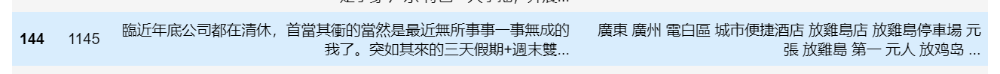
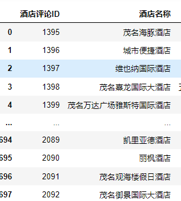

2022泰迪杯数据挖掘挑战赛C题思路

<!--more-->

# 2022泰迪杯

## 题目

1. 微信公众号文章分类：
   - 二分类问题
2. 周边游产品热度分析：
   - 提取产品和语料
   - 建立多维热度评价模型，按年度进行热度分析并排名
3. 构建旅游图谱
   - 关联度分析
   - 构建以景区、酒店、餐饮为核心的强关联模式
   - 进行可视化分析
4. 产品需求的变化分析
   - 分析疫情前后旅游产品的变化
   - 写一封信提出政策建议

##  第一题

### 文本预处理

1. 数据清洗去重

- [x] 不排除 标题与文章不符合的情况，因此把标题与文章以同等地位来看
- [x] 字符乱码 
- [x] 文本长度分析

2. 分词

- [x] jieba

3. 去停用词

- [x] 中文的语气词以及标点符号和特殊字符

### 相关性分析

TODO：

- [x] 如果content含有文旅词典中的词，则记录文章ID,最终得到相关的文章ID和不相关的
- [x] 文旅词典的构建：~~爬取文旅相关文章并提取关键词，加入文旅词典~~（人工去除不相关的词）
- [x] 爬虫检索已有词汇的近义词，将他们加入我们的词典。
- [x] 把相关和不相关的分开，按~~平均值~~
- [x] 爬取节假日词
- [x] 语料库http://ccl.pku.edu.cn:8080/ccl_corpus/search?dir=xiandai&q=%E6%96%87%E5%8C%96%E6%97%85%E6%B8%B8&LastQuery=%E6%96%87%E5%8C%96%E6%97%85%E6%B8%B8&start=350&num=50&index=FullIndex&outputFormat=HTML&orderStyle=score&encoding=UTF-8&neighborSortLength=0&maxLeftLength=30&maxRightLength=30&isForReading=no&scopestr=

## 过程

1. 分词

2. 爬虫

   > [参考1](https://www.cnblogs.com/rxxaa123/p/14262721.html)
   >
   > [参考2](https://blog.csdn.net/weixin_59071011/article/details/118388556)

   - 安装requests库

   - 爬取[近义词网站](https://kmcha.com/similar/)保存所有的词语为一个新的词典

     删除一些不相关的词“体现”，“清楚”以及单字 

3. 制作词表：

   1. 首先对爬取的近义词网站的词语做分析并加入词典
   2. 对爬取中国文旅网的词语做分析并加入词典
   3. 对爬取语料库的的词语做分析并加入词典

4. 相关性分析：

   1. 计数每篇文章各包含词表的多少个单词

   2. 对此数据做分析，每篇文章标题包含词表单词个数/每篇文章标题词数=title_fre。每篇文章包含词表单词个数/每篇文章词数=content_fre，最终fre=title_fre*0.7+content_fre*(1-0.7).

      分析fre当此值超过 *一列fre的25%分位数，*则标记为相关，否则标记为不相关。

      

### 论文

《结合注意力机制的长文本分类方法》:

- **abstract**:  发现和过滤这种与主题相关性低的句子，加大对文本局部信息的注意力，可在提高长文本分类效率的同时，改善其分类效果。

- 文本信息过滤：

  >基于词袋去停用词、去高频词；丢失了词序信息
  >特征提取：互信息，信息增益，卡方值。

- 特征表示方法

  >词向量：向量加是一种简单有效的语义组合方法，但是该方法与 BOW 模型一样忽略了词序信息
  >分布式记忆模型( Distributed Memory model of Paragraph Vectors，PVDM)，可将任意长度文本表示为定长的段落向量使句子级信息过滤成为可能

- 改善文本分析效果： attention机制

- **总结**：结合注意力机制的文本过滤方法及分类模型。

> 1. 建立过滤后文本的分类性能
> 2. 根据句子注意力进行信息过滤
> 3. 构建结合句子注意力的卷积神经网络分类模型，改善过滤后文本的分类性能

## 第二题

### What did I do

先把每一年的所有语料提取出来，再分别提取每一条的产品。把酒店、景区、餐饮店名全部加入白名单。提取后对于同样或相似的产品,将产品ID改为一样。

- 游记年份统一以出发时间为准酒店评论以入住日期为准。
- 微信公众号不考虑因为不能衡量热度。
- 若出发时间缺失则以发布时间为准。若出发时间为不在（2020-2021）则认为是无效数据。

1. 安装hanlp
2. 安装full,包括了
3. 下载到C:\Users\k\AppData\Roaming\hanlp
4. https://www.cnblogs.com/gstblog/p/9233566.html str函数错误

5. 预处理、规定。（对于微信公众号的内容本部分不涉及，）

   1. 首先[繁体字转简体字](https://blog.csdn.net/qq_19309473/article/details/110952091)
      
   2. 建立中国行政区划词典去除省、市地名。
   3. 建立全世界国家词典
   4. 建立其他词典，如中国、潮汕等非行政区划地名。
   5. 若同一评论提取到的多个相同实体记为一次。
   6. 除游记以外，酒店、餐饮、景区名称去除括号内的内容，并将这些名称加入提取白名单。白名单词典中的词语会尽量被输出。
   7. (其实提取实体并不需要完全提取，比如“国际大饭店”，可以提取语料，再人工判断。)

6. 对每一句评论：

   1. 先分词

   2. 再实体提取(利用HanLP命名实体识别模块）

      第一次用MSRA_NER_ELECTRA_SMALL_ZH。后面更换为(hanlp.pretrained.ner.MSRA_NER_BERT_BASE_ZH)

   3. 取出实体类型为地名、机构名的

   4. 对于去除特殊符号以后，实体长度>2的：

   5. 若实体名称不为行政区划、其他词典里的词则将词语加入提取的实体列表。从而得到每一条评论提取出的

   6. 由于游记字数分布十分不均匀，影响模型性能。因此将大于4000字的游记攻略提取出来，进行分割。将其分为原始长度的一半再进行提取。

   7. 最后将提取出的实体与数据已有的产品ID合并

   8. 对提取后的表进行相似度分析将相似的合并

   9. 人工去重

从9833条语料中提取出 1741个实体。

## 第三题

假设将各分店看为一家店分析关联模式。

### 问题分析：

 对于问题2中依托海量信息提取出的实体，如果仅仅只靠传统的分析技术，难以对其内在关联进行有效的捕捉。此外，由于文本数据庞大，且来源复杂，造成其实体关系特征稀疏，比如关系实例并无清晰的关系词或有歧义等。如：【面向开发领域文本的实体关系抽取】然而本题中虽然文本规模巨大，但是涉及领域并不多，因此可以只对其包含的几种实体关系类型进行分析研究。在以景区、酒店、餐饮为核心的强关联模式的要求下，我们重点挖掘这三类已提取出的实体之间的关系，提取核心旅游产品，并构建基于图的本地旅游图谱。

### 《面向开放领域文本的实体关系抽取》郭喜跃：

评价实体关系抽取性能优劣的指标。

（1）一种基于句法语义特征的实体关系抽取方法。

	特征选择：词法分析、上下文环境、依存语法特征、语义角色标注特征以及核心谓词与实体的位置距离特征。
	
	机器学习方法：以SVM模型为基础，构建基于特征空间转换的训练模型。

#### 3.2 关系的句法语义**特征向量**的构建

##### 3.2.1依存句法分析：通过分析依存关系揭示句法结构。

中国-主席-习近平

美国-总统-奥巴马

##### 3.2.2 语义角色标注:以谓词为支点，分析并标注各短语在句子中的语义成分。

实体的类型和实体对的组合隐性暗示它在语义角色标注结果这的位置和作用。

##### 3.2.3 核心谓语与实体的位置距离关系

实体与核心谓语的平均距离和实体与普通谓语的平均距离有明显差距，后者是前者的1.5倍。

#### 关系分类训练模型

#### todo

- [x] 图标号

- [x] 签字
- [ ] 整理代码
- [x] 画图
- [ ] 第三题结果