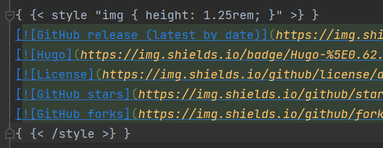

# Blog LiquidException

Solving the deploying problem.
<!--more-->
## Error
While I push my hugo project to github, action deploying went wrong: 

## Code

## Solve the problem
1. delete these two rows

   

2. change {{ to { { (add a space between them):

   (https://www.ucloud.cn/yun/39853.html):

## Trouble Shooting
There is problem description on the [jekyll](https://jekyllrb.com/docs/troubleshooting/#configuration-problems) pages but not solution.

And [add a.nojekyll](https://gitee.com/help/articles/4136#article-header1) doesn't work for my case.
