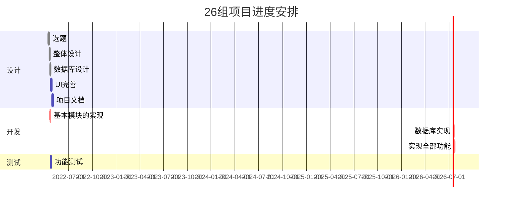

# Flask Plan

Plans
<!--more-->

%% 语法示例


gantt
        dateFormat  YYYY-MM-DD
     
        title  26组项目进度安排
     
        section 设计
     
        选题                      :done,    des1, 2022-04-14,2022-04-18
     
        整体设计                     :done,  des2, 2022-04-19, 3d
     
        数据库设计                     :done, des3, after des2, 1d
     
    UI完善                    :    active,     des4, after des3, 5d
      项目文档                               : active,2022-04-29,2022-05-04
     
        section 开发
     
        基本模块的实现                             :crit, done, des4,after des2, 2d
     
        数据库实现                                 :crit, active, after dse3,3d
     
        实现全部功能                              :crit, 3d
        
        section 测试
     
        功能测试                              :active, a1, after des4, 3d

